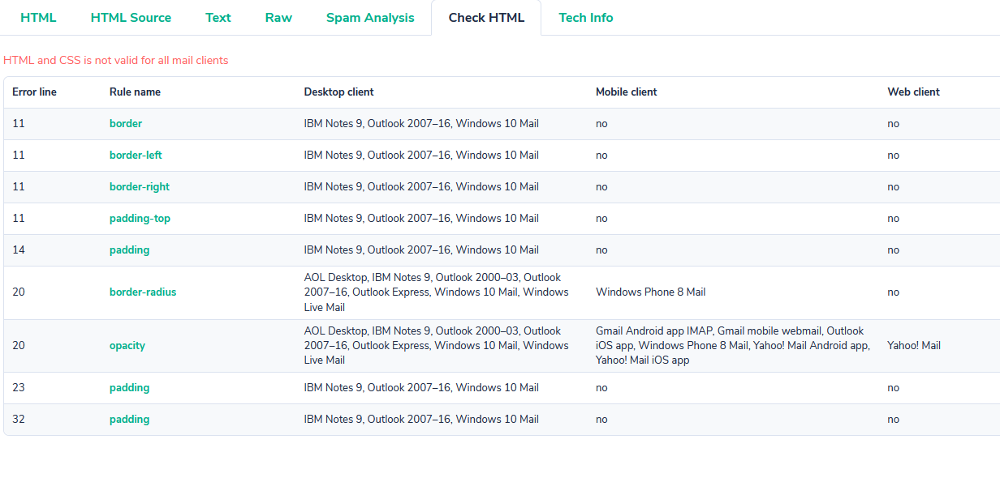

# email-signature
Moderately good signatures for email.

## Email Signature

Each email client will render the signature differently, but here are some examples.

### Gmail

### Windows Mail

## Set up

Edit the `signature.json` file to include the information you'd like to show.

Run the python script to generate the email signature. `python main.py > output.html`. Open that file in your browser, select all, copy, and paste into your email signature box (critically this isn't the html email composition page which escapes the html). Worked for me on gmail.

## Testing

So email css + html support is a total nightmare. I found [mailtrap](https://mailtrap.io) to be super helpful to check over the html and show me the properties that weren't valid. This one isn't perfect, but it was close enough for my needs. Seriously, how is the border property not supported everywhere?

## Notes

The `signature.json` file is ignored in git since I ran `git update-index --assume-unchanged signature.json`. If you need to undo that future David, `git update-index --no-assume-unchanged signature.json` is what you're looking for.